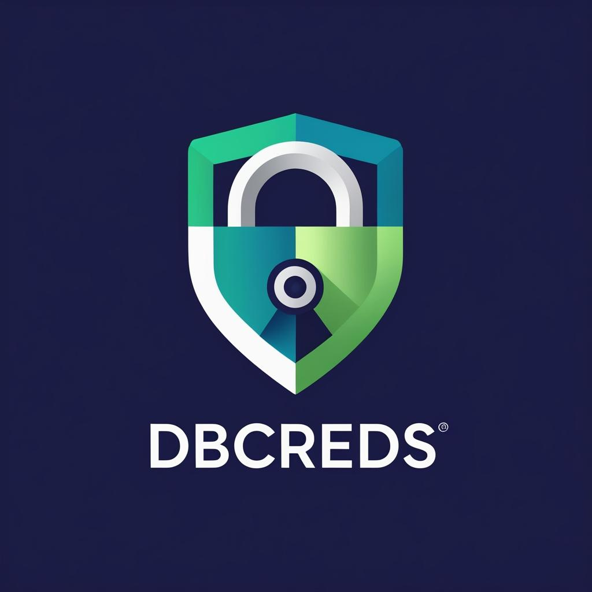

# README.md
<p align="center">
  
</p>

<h1 align="center">dbcreds</h1>

<p align="center">
  Professional database credentials management with security and team collaboration in mind.
</p>

## Features

--8<-- "docs/includes/features-list.md"

## Installation

--8<-- "docs/includes/installation-full.md"

## Quick Start

### 1. Initialize dbcreds

```bash
dbcreds init
```

### 2. Add credentials

```bash
# Add development database
dbcreds add dev --type postgresql
# Interactive prompts for connection details

# Add production database
dbcreds add prod --type postgresql --server prod.db.com --port 5432 --database myapp
# Password prompt appears
```

### 3. Use in Python

--8<-- "docs/includes/python-examples.md"

## CLI Usage

--8<-- "docs/includes/cli-examples.md"

## Web Interface

Start the web interface for team credential management:

```bash
dbcreds-server
# Visit http://localhost:8000
```

## Configuration

dbcreds stores configuration in `~/.dbcreds/config.json` and credentials in your system's secure storage.

## Development

--8<-- "docs/includes/development.md"

## Security

- Credentials are never stored in plain text
- Each environment has isolated credentials
- Password rotation reminders
- Audit logging for credential access
- Team-based access control in web UI

## License

MIT License - see LICENSE file for details.