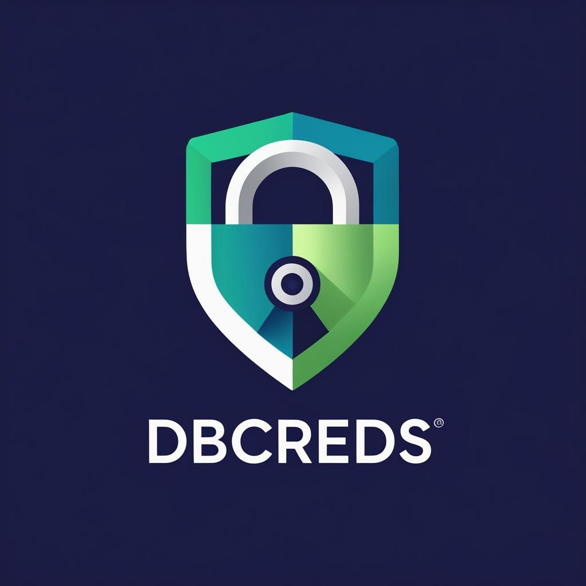

# Welcome to dbcreds

  
  
  <h1 style="font-size: 3rem; margin: 0;">dbcreds</h1>
  
Professional Database Credentials Management

  
  

    <a href="getting-started/quickstart/" class="md-button md-button--primary" style="margin: 0.5rem;">
      Get Started →
    </a>
    <a href="guide/cli/" class="md-button" style="margin: 0.5rem; background: transparent; border: 2px solid white;">
      View Documentation
    </a>
  

## 🔐 Secure by Design

  
  

    <h3>🛡️ Multiple Storage Backends</h3>
    
Leverage your system's native credential store - Windows Credential Manager, macOS Keychain, or Linux Secret Service.

  

  
  

    <h3>🔑 Never Plain Text</h3>
    
Credentials are encrypted at rest using industry-standard encryption. Your passwords never touch disk in plain text.

  

  
  

    <h3>🔄 Password Rotation Tracking</h3>
    
Built-in password expiry tracking with notifications. Never forget to rotate credentials again.

  

  

## ⚡ Quick Start

--8<-- "includes/quickstart.md"

## 🎯 Key Features

  
  

    <h3>🌍 Multi-Environment</h3>
    
Manage credentials for development, staging, and production environments with ease.

  

  
  

    <h3>🚀 Rich CLI</h3>
    
Beautiful command-line interface built with Rich and Typer for a delightful developer experience.

  

  
  

    <h3>🌐 Web Interface</h3>
    
Optional FastAPI web interface for team collaboration and visual credential management.

  

  
  

    <h3>📊 Multi-Database</h3>
    
Support for PostgreSQL, MySQL, Oracle, SQL Server, and more.

  

  
  

    <h3>🐍 Python First</h3>
    
Seamless integration with SQLAlchemy, pandas, and async frameworks.

  

  
  

    <h3>📝 Type Safe</h3>
    
Full type hints with Pydantic models for reliable, maintainable code.

  

  

## 📚 Documentation

- **[Quickstart Guide](getting-started/quickstart.md)** - Get up and running in 5 minutes
- **[CLI Reference](guide/cli.md)** - Complete command-line documentation
- **[Python API](guide/python-api.md)** - Use dbcreds in your Python applications
- **[Web Interface](guide/web-interface.md)** - Set up the team collaboration interface
- **[API Reference](api/core.md)** - Detailed API documentation

## 🔧 Installation

--8<-- "includes/installation-tabs.md"

## 💡 Why dbcreds?

!!! tip "Stop hardcoding credentials"
    No more passwords in code, environment files, or notebooks. dbcreds provides a secure, 
    centralized way to manage database credentials across all your projects.

!!! info "Built for teams"
    With the web interface, team members can securely share access to development and staging 
    databases without sharing passwords directly.

!!! success "Production ready"
    Used in production environments with support for password rotation policies, audit logging, 
    and enterprise security requirements.

---

  Made with 💚 by <a href="https://github.com/Sunnova-ShakesDlamini" style="color: var(--dbcreds-teal);">Sunnova ShakesDlamini</a>

